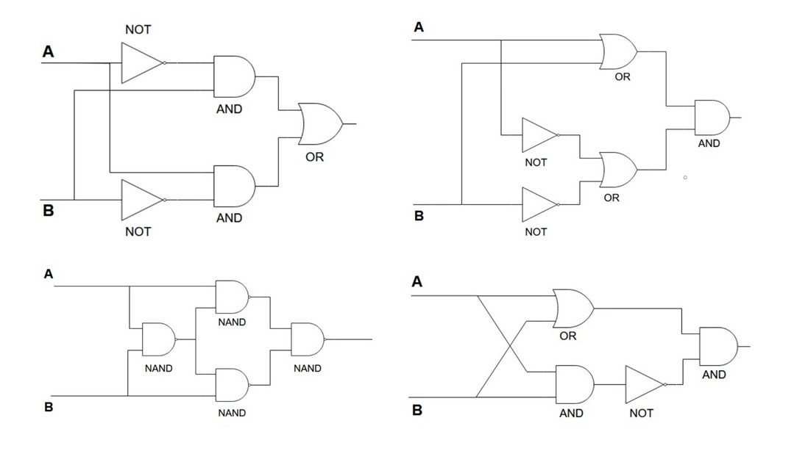

## Assignment 5. Bitwise XOR without XOR
Expressing the binary XOR logical operation without using the C++ XOR operator in several different ways. In addition - binary multiplication with full-adder.

