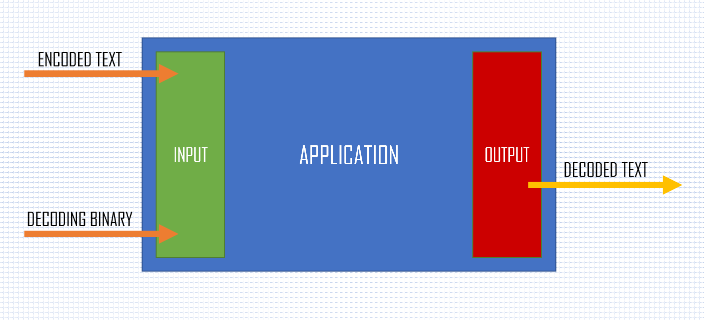
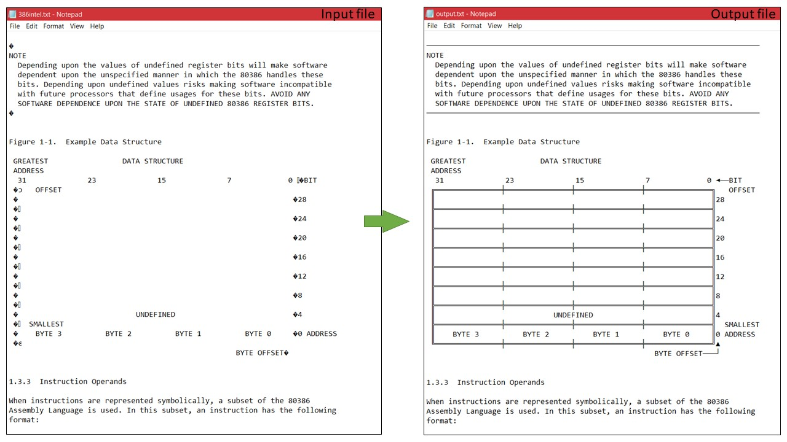
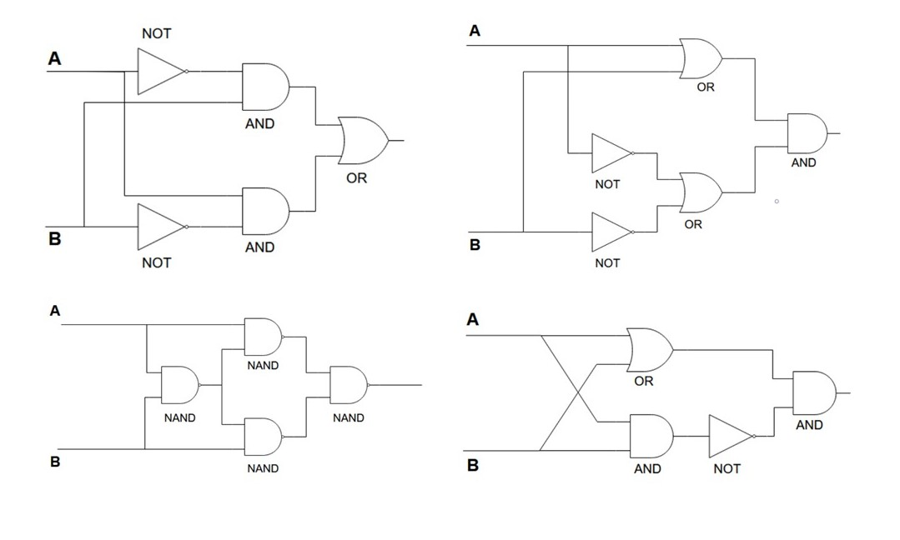

# CA2022
 Computer Architecture university study subject assignments (“Turing Parallel Simulator”, “Assembler & SSE Parallel Pythagorean Number Calculation”, “Simple Virtual Machine”, “CP437 to UTF-8 Converter”, “Bitwise XOR without XOR”).

## Assignment 1. Turing Parallel Simulator
A Turing simulator written in C++ that can run multiple Turing code files in parallel with visualization. Capable of detecting infinite loops during run-time.

## Assignment 2. Assembler & SSE Parallel Pythagorean Number Calculation
An inline assembly application that finds all Pythagorean numbers and checks several of them at the same time by utilizing SSE instructions, the output is provided in CSV format. Another assembler application converts a given string to an integer.

## Assignment 3. Simple Virtual Machine
A VM written in C++ that runs a provided custom binary file with VM specific execution codes and commands to encode/decode given text.

## Assignment 4. CP437 to UTF-8 Converter
Code page 437 (character set of the original IBM PC) text to UTF-8 converter for user provided files.

## Assignment 5. Bitwise XOR without XOR
Expressing the binary XOR logical operation without using the C++ XOR operator in several different ways. In addition - binary multiplication with full-adder.

