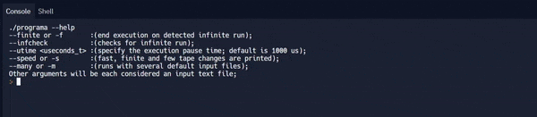

## Assignment 1. Turing Parallel Simulator
A Turing simulator written in C++ that can run multiple Turing code files in parallel with visualization. Capable of detecting infinite loops during run-time.

